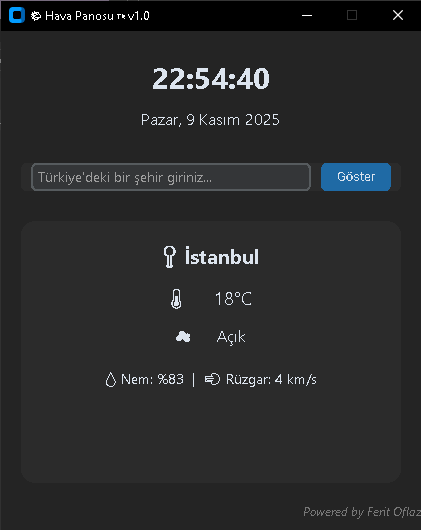

# 🌤️ Hava Panosu 🇹🇷 v1.0

Modern, sade ve tamamen ücretsiz çalışan **hava durumu ve saat uygulaması**.  
Hiçbir API anahtarı gerektirmez — sadece aç, şehrini seç ve hava durumunu anında gör!  

---

## 🖼️ Uygulama Önizlemesi


---

## 🚀 Özellikler
- 📍 Açılışta otomatik olarak **İstanbul** bilgilerini gösterir  
- 🌦️ Hava durumu açıklamaları **Türkçe** olarak görüntülenir  
- 🕒 Gerçek zamanlı **saat ve tarih**, Türkçe gün/ay formatında  
- 🧭 Türkiye şehirleri için doğru ve güncel veriler  
- 🎨 Modern ve sade **CustomTkinter** arayüzü  
- 💡 “Powered by Ferit Oflaz” imzası ile kişisel dokunuş  
- 💾 Çalışması için hiçbir ek kurulum veya API gerekmez  

---

## 📂 Proje Yapısı
```
Hava-Panosu/
├── HavaPanosu_v1.0.py
├── cloud.ico
├── dist/
│   └── HavaPanosu_v1.0.exe
├── preview.png
├── README.md
└── LICENSE
```

---

## 🛠️ Kurulum

### 🔹 1. Yalnızca uygulamayı kullanmak istiyorsanız
GitHub’ın **Releases** bölümünden `.exe` dosyasını indirip doğrudan çalıştırabilirsiniz.  
📦 [💾 HavaPanosu_v1.0.exe indir (en son sürüm)](https://github.com/<kullanici-adin>/hava-panosu-v1/releases/latest/download/HavaPanosu_v1.0.exe)

Hiçbir ek kurulum gerekmez — çift tıklayıp hemen kullanabilirsiniz.

---

## 🔹 2. Geliştirici olarak çalıştırmak istiyorsanız
```bash
pip install customtkinter requests
python HavaPanosu_v1.0.py
```

---

## 🪪 Lisans
Bu proje [MIT Lisansı](./LICENSE) altında yayınlanmıştır.  
Dilediğiniz gibi kullanabilir, düzenleyebilir ve paylaşabilirsiniz.  
Telif hakkı © 2025 **Ferit**

---
